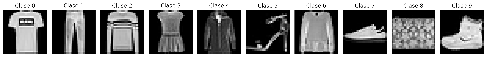
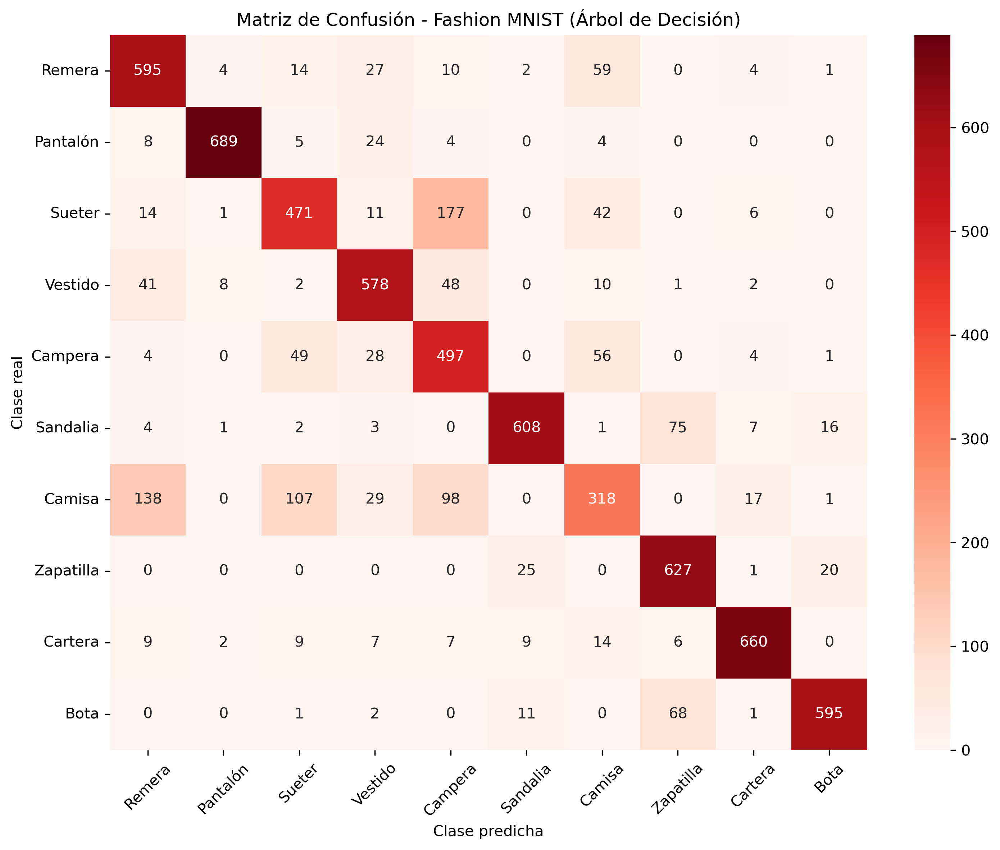

# 👕 Fashion MNIST Classification Analysis

This project explores the Fashion-MNIST dataset through exploratory data analysis and machine learning techniques.

The project includes image visualization, feature selection, binary classification using K-Nearest Neighbors (KNN), multiclass classification using Decision Trees, hyperparameter tuning, and model evaluation using cross-validation and confusion matrices.

---

## 📖 Project Overview

The objective of this project is to analyze the Fashion-MNIST dataset and compare different machine learning approaches for image classification.

The workflow includes:

- Exploratory Data Analysis (EDA)
- Image visualization
- Feature selection
- Binary classification with KNN
- Multiclass classification with Decision Trees
- Hyperparameter tuning
- Cross-validation
- Model evaluation using confusion matrices

---

## 📂 Dataset

The project uses the **Fashion-MNIST** dataset, which contains grayscale images (28×28 pixels) of clothing items.

The dataset consists of **70,000 labeled images** belonging to **10 clothing categories**, including:

- T-shirt
- Trouser
- Pullover
- Dress
- Coat
- Sandal
- Shirt
- Sneaker
- Bag
- Ankle boot

---

## 🛠 Technologies

- Python
- Pandas
- NumPy
- Matplotlib
- Seaborn
- Scikit-learn

---

## 🤖 Machine Learning Models

### Binary Classification

- K-Nearest Neighbors (KNN)
- Manual feature selection
- Pixel importance analysis
- Model comparison using different values of *k*

### Multiclass Classification

- Decision Tree Classifier
- Cross-validation (K-Fold)
- Hyperparameter tuning
- Final evaluation on a validation dataset

---

## 📁 Project Structure

```text
fashion-mnist-classification-analysis/
│
├── data/
│   └── raw/
│
├── outputs/
│   └── figures/
│
├── report/
│
├── src/
│   └── main.py
│
├── requirements.txt
├── .gitignore
└── README.md
```

---

## 🚀 How to Run

Clone the repository:

```bash
git clone https://github.com/luciamiramontes/fashion-mnist-classification-analysis.git
```

Install the dependencies:

```bash
pip install -r requirements.txt
```

Run the project:

```bash
cd src
python main.py
```

> **Note:** The complete hyperparameter search is disabled by default (`RUN_LONG_ANALYSIS = False`) because it can take approximately 30 minutes depending on the hardware.

---

## 📈 Sample Results

### Fashion-MNIST Classes



### Decision Tree Confusion Matrix



---

## 🎯 Skills Demonstrated

- Exploratory Data Analysis (EDA)
- Machine Learning
- Image Classification
- Feature Engineering
- K-Nearest Neighbors (KNN)
- Decision Trees
- Hyperparameter Tuning
- Cross Validation
- Confusion Matrix Analysis
- Data Visualization

---

## 👥 Authors

Developed as an academic project for the **Data Laboratory** course at UBA.

- Marcos Matascuso
- Lucia Miramontes
- Florencia González Rouco

---

## 📜 License

This repository is intended for educational and portfolio purposes.